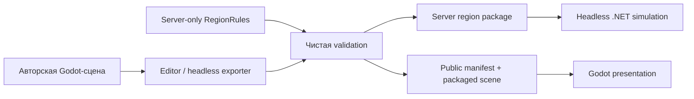
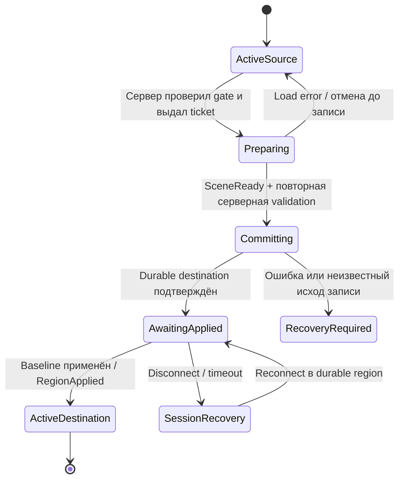

# ADR 0012: Регионы, созданные сценами Godot

## Status

**Частично принято — направление D1 и demo-рамки D2, 2026-10-09.**
После подготовки плана пользователь разрешил продолжить. Реализован R1 (authoring
каркас); дальнейшие этапы проходят отдельную приёмку. D4 остаётся предложением,
полный loading protocol и production navigation этим подтверждением не реализованы.

Уточнение 2026-10-10: направление рельефа внутри регионов и общих открытых
подземелий через региональные входы принято в [ADR 0014](0014-terrain-and-shared-dungeons.md).
Backend интеграционного среза принят в ADR 0015. D3 принят пользователем:
combat tag запрещает любой региональный переход. Высоты и readiness/baseline/
activation проверяются на двух тестовых картах; полный R4/R8 ещё не завершён.

Источник направления: [Регионы мира и переходы между локациями](https://app.notion.com/p/3f38867306b181b59c0cf8aa6df42dca),
прочитан 2026-10-08, редакция страницы 2026-10-08T15:52:56.418Z.
Страница сама обозначена как предложенное направление. Упоминание в ней ещё не
реализованных региональных переходов устарело относительно текущего этапа18.

Связанные решения: ADR0001, ADR0004, ADR0011. После утверждения этот ADR заменит
только способ производства окружения из ADR0004 и дополнит загрузку в ADR0011.
Server authority, fixed tick, ownership, single shard и durable commit сохраняются.
Последовательность реализации: [.codex/region-scenes-plan.md](../../.codex/region-scenes-plan.md).

## Context

Технический срез уже связывает movement/combat/Echo/inventory/progression/world state,
persistence/social и два региона. Протокол24, SQLschema8, SQLite Development.
Производственный способ создания локаций ещё не реализован:

| Сейчас | Требуется |
| --- | --- |
| World.tscn — общий контейнер, NavigationVisual строит препятствия из grid | Отдельный редактируемый PackedScene каждого региона |
| StarterZonePresentation программно размещает окружение | Модели, props, материалы, освещение и композиция в редакторе |
| Координаты NPC/станций/границ лежат в нескольких server definitions | Геометрия и размещение экспортируются из одной авторской сцены |
| После commit destination actor сразу активируется | Загрузка клиента включена в явный протокол перехода |
| Плоская сетка ≤1024 клеток, полная передача карты | Ограниченный демонстрационный backend; дальнейшая навигация расширяется отдельно |
| В SavedProgression хранится одна архивная карта | Для большего мира нужна самостоятельная модель региональных карт |

Региональная сцена не определяет урон, лут, экономику, условия открытия профессий
или серверное владение. Сцена определяет авторский уровень; проверенный build
даёт серверу независимые данные для симуляции.

## Decision

### 1. Мир и текущий объём

- Один persistent single-shard мир, регион — одна общая территория для игроков.
- Физические дороги/ворота/перевалы ведут к границам; допускается короткая загрузка.
- Два небольших демонстрационных региона сначала работают в одном процессе.
- Сохраняются persistent keys `prototype`, `outskirts` и существующие world keys.
  Имена сцен и показанные игроку названия могут меняться независимо от этих keys.
- Маунт и обмен/продажа карт отложены по явному решению пользователя.
- Крупные регионы, высоты и несколько этажей не объявляются готовыми от простого
  переноса BoxMesh в .tscn. Они имеют собственный этап навигации и измерений.
- Нет нового server process, новой БД, engine replacement или gameplay layers.

### 2. Разделение данных

| Источник/артефакт | Ответственность | Где находится |
| --- | --- | --- |
| Авторская .tscn + вложенные props/resources | Вид региона, geometry, placement, публичные anchors | Content.Client/Scenes/Regions |
| RegionRules | NPC/skill/item definitions, rewards, скрытые условия, route graph и balance | Content.Server/Data/RegionRules |
| Экспорт server region package | Проверенные bounds, navigation, anchors, placement и ссылки на rules | Content.Server/Data/Regions |
| Экспорт public client manifest | Локальная сцена, совместимость geometry, открытые bindings/variants | Content.Client/Resources/Regions |
| Runtime region state | Открытый мост, запасы, события, market, loot и публичные ревизии | Server simulation + Content.Database |
| Protocol DTO | Разрешённое игроку состояние, loading control, numeric runtime IDs | Content.Shared/Network |

Координаты gameplay placement редактируются в сцене, а не дублируются вручную в JSON.
Правила и закрытые сведения редактируются на серверной стороне. Editor dock может
показывать обе части, но server-only поля не сериализуются в клиентскую сцену.
Экспортированные файлы не становятся вторым авторским источником: их генерируют
повторно; ручная правка обнаруживается проверкой build.

### 3. Предлагаемая структура

```text
Content.Client/
  Scenes/
    App/GameRoot.tscn
    Regions/
      Prototype/Prototype.tscn
      Outskirts/Outskirts.tscn
    Characters/PlayerAvatar.tscn
    Characters/EchoAvatar.tscn
    Props/Buildings/ Trees/ Rocks/ Gates/
    UI/Loading/ HUD/ Inventory/ Map/
  Scripts/Regions/
    RegionSceneLoader.cs
    RegionSceneBindings.cs
    RegionPresentation.cs
  Scripts/Editor/Regions/
    RegionRoot.cs
    EntryMarker.cs
    GateMarker.cs
    ActorSpawnMarker.cs
    InteractionMarker.cs
    NavigationPatchMarker.cs
  addons/project_g_regions/
    plugin.cfg
    RegionEditorPlugin.cs
  Resources/Regions/manifest.json

Content.Server/
  Data/RegionRules/<region>.json
  Data/Regions/<region>/region.json
  Data/Regions/<region>/navigation.json
  Data/Regions/<region>/placements.json
  Regions/
    RegionCatalog.cs
    RegionDefinition.cs
    RegionalSimulation.cs
    RegionTransitionCoordinator.cs

Content.Shared/
  Regions/                    # Публичные IDs и bounded совместимость
  Navigation/                 # Детерминированные geometry/path helpers
  Network/                    # Wire DTO; никаких editor/server rules

Content.Tests/
  Server/Regions/
  Shared/Regions/
tools/regions/                # Build orchestration и проверки экспортов
```

Это целевая раскладка, не требование переместить весь клиент одним рефакторингом.
Начинаем с текущих имён и переносим только затронутые области по этапам.
Существующие пользовательские addons/ассеты не заменяются.
Godot-зависимая часть экспортера живёт в editor tooling клиента; чистая проверка
пакета выполняется серверным validator. Отдельный tooling .NET project создаётся
только если иначе появится фактическое дублирование валидатора.

### 4. Сцена региона

```text
RegionRoot
  Environment                  # Свет, WorldEnvironment, материалы
  Terrain                      # Земля, скалы и подтверждённые collision shapes
  Decorations                  # Дома, деревья, неинтерактивные props
  PublicStateBindings          # Подготовленные варианты моста/ворот
  AuthoringAnchors              # Entry/Gate/Spawn/Interaction/NavPatch markers
```

Публичные props и variants имеют PackedScene/Node references из редактора.
Editor markers обозначают placement; не запускают AI, выдают предметы или
создают авторитетных NPC при _Ready. AuthoringAnchors удаляются из release-сцены;
runtime остаются только проверенные публичные bindings и presentation.

Динамические персонажи/NPC/Эхо/дропы создаются из подготовленных avatar/prop scenes
по серверным spawn/despawn. Instantiate здесь необходим для жизненного цикла
сущности; строительство всей локации в gameplay-коде прекращается.
Для статического интерактивного объекта используется один prepared visual binding,
а не второй mesh поверх сцены при получении сетевого состояния.

GameRoot удерживает NetworkClient, session state, loading UI и HUD.
RegionSceneLoader управляет одним активным RegionRoot. Actors/effects находятся
в отдельном runtime subtree этого региона. Camera controller получает новый target
при смене local actor; UI очищает region-specific state, сеть сохраняет соединение.
Логику большого WorldController выносим по областям только при их фактическом переносе.

### 5. Идентификаторы и совместимость

- `RegionId`: существующий bounded persistent key; не зависит от пути сцены.
- `AuthoredObjectId`/`EntryId`/`GateId`: устойчивый UUID размещённого объекта внутри
  региона. NodePath/название/порядок детей не является persistent identity.
- ID создаётся один раз в editor. Rename/move его сохраняет; duplicate placement
  требует нового ID. Проверка не исправляет конфликт автоматически при build.
- Область ID — `(RegionId, AuthoredObjectId)`. Instance одного prop не переносит
  identity размещения на другое место. Удаление persistent anchor требует migration.
- `NetworkEntityId`: прежний server-issued ulong, runtime, не переиспользуется.
- `CharacterId`/`ItemInstanceId`: прежние database IDs, не смешиваются с scene IDs.
- Public binding IDs разрешено отправлять только в рамках разрешённого состояния;
  секретный server marker не попадает в public manifest.

Разделяем четыре версии: wire ProtocolVersion; RegionSchemaVersion пакета;
ContentRevision совместимого регионального контента; WorldRevision живого состояния.
`PublicGeometryHash` идентифицирует геометрию, которую использует prediction;
`ClientSceneBuildId` — опубликованный build сцены. Сервер проверяет их согласованный
набор, клиент выбирает ресурс через собственный allowlisted manifest.

Хэш считается по каноническому sorted export без timestamps/absolute paths;
float quantization и exporter version входят в format contract. Серверные секреты
имеют отдельный private package hash. Никакой arbitrary res:// path/URL от сервера
или клиента не используется как команда загрузки файла.
Совпадение заявленного client hash — проверка совместимости, не доказательство
честности модифицированного клиента. Валидация movement/actions остаётся серверной.

### 6. Экспорт и validation



Editor plugin: проверка текущей сцены, preview geometry/anchors, export выбранного
региона и export всех регионов. Headless режим использует тот же exporter, не
отдельный алгоритм. Godot нужен при authoring/build, не для запуска сервера.
Основа tooling — стандартный [EditorPlugin Godot](https://docs.godotengine.org/en/stable/tutorials/plugins/editor/making_plugins.html).

Порядок export:

1. Проверить RegionRoot, identity и dependency resources. Корень имеет единичный
   transform; используем метры, X/Z — plane движения, Y — вверх.
2. Собрать marked surfaces/blockers и вычислить region-local transforms, включая
   вложенные instances. Некорректный scale/unsupported collider дают ошибку с node path.
3. Собрать entry/gate volumes, NPC/interaction placements и prepared state patches.
4. Построить навигацию текущего поддерживаемого backend и проверить все placements.
5. Сопоставить server rules, route targets/entries и template definitions.
6. Canonical serialize, hashes, bounds и schema; записать во временный export output.
7. Проверить весь world graph и обе части build; только затем заменить published
   набор артефактов. Ошибка не оставляет наполовину обновлённый пакет.

Обязательные ошибки: duplicate ID, неизвестная definition/entry, неверный gate
target, spawn в препятствии, недостаточная ширина прохода, arrival сразу запускает
обратный переход, unmatched public binding, неверный variant, слишком большой
пакет, missing resource, stale export, secret data в client build.
Односторонний маршрут разрешён только явно; текущие две demo routes reciprocal.

Для persistent размещений генерируется diff: added/moved/removed IDs и изменение
geometry. Incompatible diff блокирует запуск без миграционного плана. Визуальная
правка, не меняющая gameplay geometry/bindings, не требует переноса world state.

Release validation проверяет фактический packaged client artifact, а не только
отсутствие секретов в manifest. ServerRules не должны попасть в PCK/resources,
authoring scripts не должны сохранять закрытые поля в release resources.

### 7. Навигация и физическая геометрия

Первый экспорт сохраняет детерминированные NavigationGrid/NavigationMover и их
текущие 1024-cell bounds. Две demo scenes плоские, без stacked walkable floors.
Коллизии классифицируются: walkable surface, movement blocker, combat occluder,
декоративная physics shape. Маска не берётся из любого видимого mesh автоматически.

Первый bake поддерживает перечисленный в exporter contract набор blocker shapes
и yaw transforms. Консервативный rasterization не оставляет проходимой клетку,
пересекающую препятствие; radius expansion учитывается согласованно с mover.
Неподдерживаемую форму не заменяем молча приблизительной свободной областью.
Preview показывает закрытые клетки и safe arrival; narrow passages проверяются
для текущего agent profile. Jolt collision не заменяет server validation.

RMB ray пересекает выделенную click surface сцены. У плоского demo результат
переводится в прежнее X/Z intention; сервер перепроверяет bounds/walkability.
Для высот этого недостаточно: текущие snapshots/LOS/pathfinding используют X/Z.
Требования к высотам и физическим поверхностям приняты в ADR 0014; реализация
и выбор backend R7/R8 требуются до производства склонов/многоэтажности.

Большие регионы: предлагаем bounded navigation tiles + межтайловый graph,
геометрию prediction передаём по relevant tiles и revision. Не увеличиваем
MaxNavigationCells без bounded parser, memory/path budgets и map persistence.
Tile — technical partition одной территории, не instance/layer и не загрузочный
переход для игрока. Единственный world owner и AOI остаются региональными.

До выбора такого backend проводим spike: tiled grid против offline baked polygon
mesh с собственной .NET path/clearance simulation. Godot NavigationServer не
переносится в server runtime. [Godot 3D navigation overview](https://docs.godotengine.org/en/stable/tutorials/navigation/navigation_introduction_3d.html)
используется как описание editor возможностей, не обещание сетевой детерминированности.
Параметры tiles, heights/layers, search limits и максимальный region size фиксируются
отдельным ADR после измерений; демонстрационная карта не закрепляет их навсегда.

### 8. Динамические состояния региона

Base region package неизменяем в runtime. Живой state накладывает versioned patches
на заранее подготовленные authored objects: например, bridge_closed/bridge_open.
Server RegionStateSystem изменяет gameplay collision/navigation и persistent state;
client RegionPresentation выбирает prepared scene variant по подтверждённому state.

Patch определяется устойчивым object/patch ID, допустимыми состояниями и public
geometry delta. List cell indices — output bake конкретной revision, не авторская
identity моста. В migration текущий world-node key и итог repaired/patrol state
сохраняются; old OpeningCells сопоставляются с новым patch explicit mapping.

Client получает base geometry + согласованный state baseline/revision до movement.
Out-of-order patch не откатывает состояние; revision gap требует bounded resync.
World state, geometry revision и presentation variant применяются согласованно.
Закрытие занятого прохода и перемещение игроков в таком patch — отдельное gameplay
правило; первый перенос воспроизводит уже существующее открытие переправы.
Live-DM выбирает RegionId и разрешённый patch; произвольное создание terrain/code
в live console не входит в эту архитектуру.

### 9. Переход и готовность клиента

Загрузка scene resources не выполняется в server tick и не удерживает SQL transaction.
Используем ResourceLoader.LoadThreadedRequest/Status; get вызывается после Loaded.
Instantiate/AddChild/bind/удаление nodes выполняются в main thread. Это соответствует
[background loading Godot](https://docs.godotengine.org/en/stable/tutorials/io/background_loading.html).

Предлагается двухфазная готовность: `SceneReady` до durable transfer и `RegionApplied`
после применения destination baseline. Stage18 freeze/commit остаётся коротким
барьером; ожидание диска клиента не останавливает остальные регионы/игроков.



Последовательность:

1. Сервер обнаруживает gate volume по authoritative position и проверяет доступ,
   состояние маршрута/персонажа и entry capacity. Клиент не выбирает destination.
2. Сервер выдаёт одно bounded preparation ticket с nonce, target compatibility и
   TTL. Source ownership остаётся действующим; source actor симулируется, получает
   damage, cooldowns и effects. Loader не создаёт защиту в source.
3. Клиент загружает target PackedScene/resource dependencies, проверяет manifest и
   bindings. Исходная сцена пока удерживается. Закрытые соседние сцены заранее
   клиенту не объявляются. Сеть продолжает PollEvents, gameplay input управляется
   loading state; запрос не создаёт растущую очередь packets/scenes.
4. SceneReady подтверждает конкретные ticket/build/hash. Сервер повторно проверяет
   alive, gate position, cast/dash/effects/trade и world route revision. Повреждение,
   смерть или закрытие route могут отменить подготовку до commit.
5. Короткий freeze/capture → fenced SQL commit destination. Persistent lease остаётся
   удержанной. При неопределённом исходе не делаем source rollback или autosave.
6. Сервер резервирует destination ownership, но actor ещё не Active для AOI/actions.
   Отправляет RegionCommit с новым epoch и bounded baseline. Все baseline packets
   относятся к этому epoch и одной load/baseline generation.
7. Клиент отсоединяет source presentation, подключает target scene, применяет
   navigation/world patches и baseline, создаёт local actor/Эхо, настраивает camera
   и UI. Только после успешного bind отправляет RegionApplied.
8. Сервер на fixed tick проверяет ticket/epoch/baseline и активирует destination
   actor один раз. RegionActivated открывает input; AOI публикует появления игрока
   и Эхо. Сообщения прошлого epoch отбрасываются.

Первоначальный login/reconnect использует тот же load/baseline/activation путь.
Он не проходит отдельным shortcut spawn-before-scene. Сервер проверяет persistent
регион перед выдачей ticket; клиент не выбирает другой save для обхода загрузки.

Baseline имеет Begin/End с load ID/revision/count bounds; End идёт после required
reliable state. Gameplay Unreliable snapshots до activation не применяются.
Baseline generation не смешивается с live deltas; если подготовка устарела,
сервер выдаёт новый ограниченный baseline, не смешивает несколько ревизий.

После commit ошибка клиента восстанавливается через durable destination. Возврат
в source не является технической отменой и потребовал бы нового server transition.
Медленный/модифицированный клиент не может удерживать резерв навсегда: TTL,
one pending ticket/session и total pending budget проверяются сервером.
Prepared actor запрещён для action, trade, pickup и повторного travel.

**Предложенные временные engineering budgets:** preload30s, apply5s, DB barrier10s
(текущий предел),1ticket/session, total≤configured session budget. Client baseline
ограничен approved AOI + wire counts; payload≤1200bytes, snapshots остаются Unreliable.
Значения конфигурируемые, проверяются в R4, не являются permanent game balance.

**D3 принят: travel запрещён, пока действует combat tag.** При combat reconnect нельзя просто
скрыть invulnerable actor на5s и назвать это сохранением старого поведения.
Транспортный timeout не должен выдавать heal/reset cooldown/PvP-tag или предметы.

### 10. Протокол

Следующая реализация обязана повысить protocol version: v24 client/server
несовместимы с описанным activation handshake. Message IDs назначаются после
проверки свободного диапазона; это не спецификация уже существующих ID81/82.
RegionEnter не переинтерпретируется молча с новым layout.

Новые логические control messages: RegionPrepare, SceneReady, LoadFailed,
RegionCommit, BaselineBegin/End, RegionApplied, RegionActivated, RegionAbort.
ReliableOrdered. Control имеет connection/session ownership, opaque ticket,
bounded compatibility fields и epoch/generation; клиент не посылает positions,
предметы или выбранный region. Data messages продолжают region envelope.

Control не превращает весь gameplay stream в ReliableOrdered. Parser проверяет
exact sizes, enums, bounded strings/counts до allocations. Поддельный ready,
повторный ack, старый ticket и сообщения чужой connection не меняют ownership.
Hash mismatch даёт понятную ошибку версии содержимого, а не generic connection failure.
Loader имеет состояния loading/failed/retry/reconnect; credentials не попадают в logs.

### 11. Persistence и rollout

Первая scene migration сохраняет region keys, bounds, grid origin/cell size,
world keys, resource/market/item IDs и схему БД. Перенос координат/удаление объектов
пока не нужен: сначала доказываем эквивалентность исходных двух карт.

Content compatibility pins добавляются versioned model migration с fixture старого
save; legacy revision не угадывается для произвольной карты. Геометрия, которую
использовали старые saves, сопоставляется explicit known baseline revision.
Moved anchors, blocked saved positions и изменённый fog требуют preview migration.
Без approved mapping incompatible save отклоняется, не создаётся новый персонаж.

После расширения числа регионов/tiles: отдельные CharacterRegionExploration records
по CharacterId/RegionId/MapRevision, bounded tile bitsets, paginated relevant delivery.
Это заменяет current+one archived map в SavedProgression; legacy карты копируются
transactionally с сохранением tutorial/discoveries. Идемпотентность миграции
проверяется повторным запуском. Не реализуется путём снятия JSON length bounds.

SQLite остаётся Development; PostgreSQL поддерживает те же модели/транзакции.
Существующие item owner fences, social lease и audit не ослабляются.
Runtime live hot-reload terrain не вводим: для первого pipeline publishes идут
через coordinated client/server build и restart. Backup/dry run на копии данных
предшествуют любой incompatible migration; рабочая .data не используется для tests.

### 12. Секреты и предел защиты

Полный route graph, закрытые gates, профессии/условия, loot/RNG и private counters
остаются в ServerRules. Клиент получает текущий разрешённый state и public geometry.
Public scene не содержит editor-only descriptions/definition refs к секретам.

Локально установленную геометрию сцены можно исследовать. Нельзя обещать сокрытие
формы пещеры только выключением Visible или шифрованием ключом в том же клиенте.
Первый pipeline защищает условия/доступность/серверный контент, не гарантирует
невозможность datamining статического terrain. Если позже потребуется скрывать
саму геометрию, нужен отдельный delivery/content decision до создания таких зон.

## Alternatives considered

| Вариант | Сложность и эксплуатация | Размер мира / loading | Проверки и миграция | Ошибки / Mobile |
| --- | --- | --- | --- | --- |
| Редакторские сцены + проверенный offline export — рекомендация | Editor tooling и два build artifacts; сервер обычный .NET | Региональные загрузки; позже tiles/chunks | Одна geometry source, reproducible export, explicit revision migration | Mismatch fail closed; peak resources old+new нужно измерять |
| Сцены + независимые вручную заданные server maps | Быстрый старт, постоянная двойная поддержка | Возможны крупные сцены, размер server nav всё ещё ограничен | Drift obstacles/gates, сложный review; высокий migration risk | Клиент проходит иначе сервера; scene assets сами не решают Mobile |
| Godot runtime на сервере | Совпадение части engine APIs, новый runtime/deployment | Серверные scene loading и physics расходы, не решает crowded region | Заменяет accepted foundation, меняет simulation/test dependencies | Physics/prediction не становятся автоматически детерминированными |

Для первых плоских demo scenes рекомендуется сохранить существующий grid backend.
Для крупных регионов сравнить tiled grid и exported polygon mesh в отдельном spike:
grid проще для текущей simulation/prediction и local patches, mesh экономнее описывает
сложный terrain, но требует новых deterministic .NET query/movement rules и height/LOS
contract. Оба варианта требуют memory/latency/recovery tests и offline export.
Выбор engine bake сам по себе не определяет server nav backend.

## Consequences

Труднообратимы persistent region/object IDs, coordinate frame, geometry revisions,
правила fog migration и combat/loading policy. Именно их фиксируем до увеличения
числа локаций. Пути сцен, названия и декоративные props меняются проще.

Нужны editor exporter, content CI, bounded loading state machine и переразделение
presentation. Работа над полноценной игровой локацией становится воспроизводимой:
designer двигает объект в редакторе, validator обнаруживает несовместимость до запуска.
Runtime spawn и эффекты могут оставаться программными, terrain авторится сценами.

Одновременно держим один активный регион. Во время preload разрешён temporary
resource overlap двух регионов; budget памяти учитывает этот пик и освобождение
cache refs. Если Mobile не укладывается, стратегия loading изменяется по измерению.
Loading готового ресурса не гарантирует отсутствие stalls при instantiate/render;
их длительность измеряется отдельно.

## Migration / rollout

Порядок: review D1–D4 → authoring contract → exporter → две scene-equivalent карты
→ load/activation protocol → dynamic state bindings → сохранения/failure acceptance
→ исследование и реализация крупной navigation → полная location. Blockout полной
location можно готовить раньше как preview, не обещая поддержку большой карты текущей
demo grid. Подробные этапы: [план R0–R8 / G1–G7](../../.codex/region-scenes-plan.md).
Старые функции удаляются после доказанного
замещения, историческая приёмка этапов0–18 не переименовывается в новую.
Новый protocol и content build публикуются согласованно; rollback использует
совместимый комплект binary/content/schema, а не одну старую сцену с новым server.

## Решения для утверждения перед соответствующим этапом

| ID | Предложение / варианты | Когда требуется |
| --- | --- | --- |
| D1 | Scene-authored regions + offline export, две demo scenes в одном процессе, короткая загрузка | До R1; фундамент pipeline |
| D2 | Первые demo scenes плоские на нынешнем grid; production nav определяется отдельным измеряемым spike | До R2; не закрепляет flat geometry для всей игры |
| D3 | Combat tag запрещает переход в любую другую локацию, включая подземелье | Принято пользователем 2026-10-10 |
| D4 | Первый полноценный регион: развить текущую пристань и связанную окраину; конкретные размеры/арт/плотность утверждаются после blockout | До G1; названия иных локаций из Notion — примеры |

D3 принят отдельным явным ответом пользователя: travel с tag запрещён.
Deadlines сохраняются при reconnect; ожидание geometry/baseline не снимает tag.
Публичное ожидание готовности клиента добавляет новый риск задержки в бою, поэтому
его нельзя скрыть в техническом refactor. Подготовка exporter/scenes от D3 не зависит.

## Deferred

Маунт, обмен/продажа карт, корабли, instances, worker handoff/gateways, production
auth и terrain hot reload; реализация высот/нескольких физических поверхностей
по ADR 0014 и выбор navigation backend R7/R8.
200/400 players/region — прежние architecture budgets, не доказанная capacity.

## Verification

Для документа: сопоставлены Notion, AGENTS, gameplay contract, ADR0001/0004/0011 и
текущий host/client/nav/persistence. R1 проверен build и Godot headless authoring smoke;
подробности записаны в плане. Остальные части ADR ещё не реализованы.
Поэтапные build/unit/UDP/Godot/migration/content checks определены в плане; результаты
прототипа443/6 не являются проверкой предлагаемого exporter или loading protocol.
