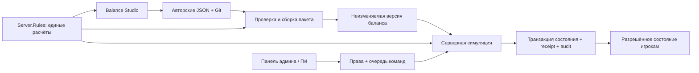

# Редактор баланса и инструменты админа/ГМ — архитектурное предложение

Статус: **историческое расширенное предложение**. Пользователь 2026-10-10 отклонил административную часть для текущего этапа и разрешил делать локальный инструмент разработки. Актуальное решение — [ADR 0013](0013-local-balance-workshop.md), использование — [руководство](../development/balance-workshop.md). Разделы ниже о правах, API, публикации и ГМ не являются активным заданием.

План этапов: [balance-tools-plan.md](../design/balance-tools-plan.md).

## 1. Цель и текущая основа

Дать человеку возможность изменять баланс через понятные поля, видеть последствия для билдов и проверять результат в игре. Отдельно дать сотрудникам ограниченные инструменты для работы с живым миром.

На момент обследования:
- `Content.Server/Data/prototype.json` содержит коэффициенты характеристик, оружие, навыки, существ, Мечника, прогрессию и другие разделы; schemaVersion 3 / balanceVersion 3.
- `ContentCatalog` проверяет данные и создаёт серверный снимок при запуске. Горячей замены каталога нет.
- `StatCalculator` содержит чистые расчёты; симуляция использует их на сервере. Часть балансируемых констант ещё в логике, например награда 1 EXP за попадание.
- `Content.Client/Scripts/UI/SwordsmanUi.cs` вручную повторяет числовые параметры навыков. Изменение JSON само по себе не обновляет эти тексты.
- Есть `LiveDmConsole` → bounded `LiveDmInbox` → fixed tick → world checkpoint/audit. Поддерживаются три подготовленные операции, вызов привязан к текущему `_world`; полноценного выбора региона и панели нет.
- `Content.Database` — существующая библиотека SQLite/PostgreSQL с транзакциями и revision fencing; новую БД для инструментов не предлагаем.

Опорные решения: ADR 0008/0009 о persistence и границах Database, направление ADR 0012 о сценах и размещении, разделы Base stats / Live-DM / защита секретов gameplay contract.

## 2. Рекомендуемое разделение

Три разных сущности:
1. **Авторские определения**: каким является меч, навык или тип моба. Источник — версионируемые серверные файлы в Git.
2. **Версия баланса**: проверенный неизменяемый пакет определений, выбранный для запуска сервера.
3. **Состояние мира**: конкретный моб, событие, инвентарь, права сотрудника, журнал операций. Источник — сервер и существующая БД.

Редактор изменяет черновик определений. Администратор активирует проверенный пакет. ГМ отправляет намерение изменить разрешённое событие в конкретном регионе. Изменение одного событийного моба не переписывает его базовый тип.

## 3. Границы модулей

Предлагаемые пути и имена; создавать проекты будем только на соответствующих этапах:

| Модуль | Ответственность и зависимости |
| --- | --- |
| `Content.Server.Rules` | Серверная .NET-библиотека: определения, валидация, StatCalculator и необходимые чистые формулы. Без Godot, БД, сети, timers и mutable world. Допустима зависимость от существующих безопасных типов Shared; обратная зависимость запрещена. |
| `Tools/Balance.Cli` | Разделение/сборка контента, проверка, расчёт тестовых билдов, отчёт различий. Использует Rules. |
| `Tools/BalanceStudio` | Отдельный Godot C# tools-проект: формы редактирования, сравнение, локальные сценарии. Использует Rules и инструменты авторинга; не входит в игровой экспорт. |
| `Content.Server/Administration` | Права, проверка команд, ограниченная очередь, выбор авторитетного региона, обработчики, receipts и audit. |
| `Tools/OperationsPanel` | Отдельная панель админа/ГМ на Godot C#: события, операции и результаты. Не получает весь закрытый каталог. Общие UI-компоненты со Studio выделять только при реальном повторении. |
| `Content.Admin.Contracts` | Версионированные DTO только административного канала. Без игровых формул, закрытого каталога и зависимости от Server. |
| `Content.Database` | SQL/migrations, транзакции записей мира, административных receipts и audit. Игровую допустимость решает сервер. |
| `Content.Shared` | Только необходимые игроку DTO, включая разрешённые параметры изученных навыков. |
| `Content.Client` | Игровой UI и отображение серверных параметров. Не ссылается на Rules, Studio или Admin.Contracts. |

`Rules` — библиотека в процессе сервера, не новый игровой сервис. Переносить только замкнутый набор чистых типов, необходимый для редактора; всю симуляцию в первом этапе не перестраивать. Существующие namespaces можно сохранить при переносе. Проверка зависимостей должна запрещать попадание серверных библиотек и файлов в игровой экспорт.



## 4. Файлы и источник истины

Предлагаемая структура внутри `Content.Server/Data/Content/`:

```text
manifest.json
Balance/stats.json
Balance/progression.json
Balance/defense.json
Weapons/training_sword.json
Abilities/Swordsman/sword_thrust.json
Creatures/arena_dummy.json
Professions/swordsman.json
Items/arena_training_sword.json
Quests/river-road-supplies.json
```

Остальные разделы мигрируют явно, с сохранением всех значений. Координаты размещения остаются в сценах/экспортах регионов по ADR 0012; редактор может показать их источник и ссылку, но не создаёт второй набор редактируемых координат.

- Stable string IDs и существующие network IDs сохраняются. Удаление/переименование используемого ID требует отчёта ссылок и отдельного плана совместимости сохранений.
- Manifest задаёт явный список файлов и версии; загрузчик запрещает выход путей за content root, неизвестные поля, повторные ключи/ID и отсутствующие ссылки. Ограничены размер пакета, число файлов и определений.
- Сборка выдаёт один канонический пакет, совместимый с действующим загрузчиком на переходном этапе, плюс manifest с hash, schemaVersion, balanceVersion и диапазоном совместимых версий Rules/server.
- Hash идентифицирует содержимое, а не автора: право публикации проверяется отдельно. `balanceVersion` не подменяет protocol version или database schema version.
- После переключения на разделённые файлы старый `prototype.json` — только явно помеченный результат сборки. Его нельзя одновременно считать вторым редактируемым источником. Автоматического fallback на устаревшую копию нет.
- Git хранит исходники и историю; черновики Studio вне release-пакета. Сохранение одного файла атомарное, сборка публикует готовый пакет атомарно после полной проверки. Внешнее изменение исходника обнаруживается по его hash и требует разрешения конфликта.

## 5. Редактор и числовая точность

Основной экран: слева категории и поиск; в центре поля выбранного объекта; справа «до / после», зависимые объекты и ошибки. Внизу — тестовый билд и выбранная цель. Действия: сохранить черновик, отменить изменение, проверить, сравнить, собрать пакет, запустить тестовую среду.

Каждое поле имеет явные тип, единицу, подсказку, технические ограничения и ID. Метаданные форм описывают серверную схему; окончательная проверка всегда в Rules. Недопустимое значение остаётся в черновике с объяснением, но не попадает в пакет.

- Игровые числа показываются целыми, проценты — максимум с одним знаком после запятой, как просил пользователь.
- У процентных полей различаются «бонус +20,0%», «урон 120,0% базового» и «шанс 20,0%». При сравнении шансов отдельно показываются процентные пункты.
- Длительности, расстояния и коэффициенты имеют собственные единицы. Точные коэффициенты доступны в расширенном режиме: существующие 1/30 и 1/36 нельзя незаметно округлить при открытии/сохранении формы.
- Округление отображения не меняет расчёт или хранимое значение. Поля, которых пользователь не касался, сохраняются без изменения числового значения; редактирование процента явно переводится в принятую внутреннюю долю.
- Формулы реализованы кодом. Новое правило требует разработки; редактор настраивает параметры поддерживаемых правил и не исполняет произвольный C#/JavaScript/SQL из поля.

## 6. Предпросмотр, сравнение и описания навыков

`PreviewRequest`: hash черновика, версия Rules, уровень/базовые характеристики/профессия/снаряжение, параметры цели и выбранный сценарий. `PreviewResult`: итоговые статы, вклады источников, урон до/после защиты, скорость атак, стоимость/восстановление ресурсов и диагностические сообщения.

Первый калькулятор считает статические показатели и ожидаемый DPS автоатаки по неподвижной цели с явно указанными допущениями. Он не обещает точное время победы в реальном бою. Перезарядки, перемещение, промахи, блок, прерывания, пассивки и ограничение ресурсами проверяются отдельным headless-сценарием через настоящую серверную симуляцию. Нельзя писать вторую упрощённую реализацию боя внутри UI.

Сценарии содержат версию правил, seed RNG, начальное состояние, горизонт и последовательность намерений. Для случайных исходов сравниваются серии запусков с одинаковым набором seed, а не один удачный крит. Отчёты различают теоретический DPS и результат сценария, показывают время без выносливости и причины остановки.

Начальные пресеты: уровни 1/15/30, допустимые распределения очков, базовый персонаж и Мечник, тренировочный меч и несколько значений защиты цели. Бюджет очков берётся из прогрессии, не дублируется числом в редакторе.

Числа в игровых описаниях должны приходить из подтверждённого серверного состояния известного игроку навыка. Локализованный текст использует именованные параметры, например `{damagePercent}`, `{staminaCost}`, `{cooldownSeconds}`. Нужно явно различать базовое описание и итоговые значения с учётом билда. Недостающие параметры добавляются в bounded DTO с версией протокола; закрытые навыки, условия профессий и каталоги не передаются. У клиента не должно оставаться отдельного набора констант Мечника.

## 7. Выпуск и применение баланса

Поток: **черновик → полная проверка → сравнение → тестовый сервер → утверждённый пакет → плановая активация**.

Для первого выпуска выбирается пакет при запуске сервера. Изменение файла на диске не меняет работающую симуляцию. Среда хранит выбранные hash/version; журнал запуска позволяет установить, каким балансом рассчитано состояние. Studio запускает свою изолированную тестовую среду с отдельной БД и портом; перенос боевой БД и перезапуск пользовательского сервера не являются кнопкой «проверить» по умолчанию.

Перед активацией проверяются ссылки сохранений, уровни/очки/экипировка и изменённые ограничения. Изменение максимального HP, лимита уровня, состава профессии или стоимости уже идущего действия может требовать политики перехода; несовместимый пакет блокируется до её выбора. Для новой системы не придумываем автоматический сброс, лечение или перераспределение очков.

Откат пакета возможен только после такой же проверки совместимости с текущими сохранениями. Это не откат совершённых покупок, выданных наград или мировых событий. Старые пакеты хранятся неизменяемыми вместе с совместимыми server builds.

Горячее применение — отдельный поздний этап. До него нужны правила для активных кастов/эффектов, cooldown, текущих ресурсов, cached stats, NPC и межрегиональной согласованности. Простая замена ссылки `ContentCatalog` недостаточна. При будущем распределении мира нужна согласованная версия в рамках release и блокировка несовместимых переходов, а не разные балансные слои для игроков.

## 8. Панель админа/ГМ и права

Права — отдельные capabilities плюс окружение и список регионов. Роли — настраиваемые наборы прав; один человек в разработке может совмещать их. Учетная запись игрока сама по себе прав сотрудника не даёт.

| Набор прав | Предлагаемые возможности |
| --- | --- |
| Designer | Читать/редактировать доступный контент, рассчитывать билды, собирать тестовые пакеты. Доступ к секретному контенту выдаётся отдельно. |
| Publisher/Admin | Выбирать совместимый release, управлять выданными полномочиями в пределах собственных прав, читать audit. |
| GM | Читать разрешённое состояние своих регионов, выполнять подготовленные операции событий. |
| Observer | Читать разрешённые отчёты без изменения состояния. |

В первой версии панели — список регионов, текущее разрешённое состояние, три существующие Live-DM операции и журнал результатов. Новые spawn/HP overrides появляются только после реализации соответствующего серверного обработчика и лимитов. Каталоги скрытых профессий, произвольное редактирование персонажей и произвольный SQL не нужны этому этапу.

Для будущего событийного моба: стабильный event-instance ID, base definition ID, разрешённый набор override-полей, регион, срок/условие завершения, revision и автор. Override фиксируется на экземпляре/событии. Награды, EXP, лут, восстановление после рестарта, поведение при завершении и влияние на уже раненого моба требуют явного gameplay-решения до включения этой операции. Без него кнопка недоступна, а не использует случайные общие награды.

Схема исполнения административной команды:
1. Панель отправляет `requestId`, окружение, `regionId`, target ID, тип операции, bounded параметры, ожидаемую revision и причину. Actor выводится из проверенной сессии, а не доверенного поля запроса.
2. Сервер проверяет identity, capability/scope, размер, rate limit и наличие свободного места в очереди. Права и состояние повторно проверяются при исполнении.
3. На границе fixed tick регион-владелец применяет подготовленную операцию. HTTP/UI поток не меняет world objects.
4. Изменение мира, receipt команды и audit коммитятся одной существующей транзакцией с revision fences; до commit результат не объявляется выполненным.
5. Повтор того же `requestId` с тем же payload возвращает сохранённый результат; другой payload с тем же ID отклоняется. Устаревшая revision даёт конфликт. Таймаут означает «результат неизвестен» и проверку статуса, а не повтор с новым ID.

Durable receipt разрешает восстановить результат после потери ответа или рестарта. Недоставленная в очередь команда не обещает выполнение. Срок хранения receipts определяется до запуска удалённого режима; после истечения окна старые команды отклоняются, а не выполняются повторно. Ошибка сохранения останавливает публикацию согласно существующему persistence barrier.

Audit: сотрудник, operation/request ID, окружение, регион/цель, причина, ограниченные before/after данные, версия баланса, UTC, результат/revision. Успех хранится атомарно с эффектом; отказы авторизации и валидации попадают в отдельный ограниченный журнал. Секреты сессий не записываются. Интерфейс показывает, можно ли отменить именно эту операцию; компенсация создаёт новую запись и не стирает историю.

## 9. Административный транспорт

Для визуальной удалённой панели предлагается приватный версионированный HTTP API внутри существующего server process: отдельный listener и bounded command/query adapter. Новый игровой процесс или отдельный write-access к БД панели не нужны. Чтения — ограниченные snapshots/страницы, а не обход живых world collections из HTTP-потока.

Это новая поверхность управления, поэтому реализуется отдельным этапом после принятия предложения. Development: явное включение, loopback и отдельные staff credentials. Для Production перед открытием удалённого доступа выбираются staff identity provider, TLS/private access, срок/отзыв сессий и правила выдачи прав. Существующий Development player token или строку секрета LiveDmConsole нельзя объявлять готовой Production-аутентификацией.

Сначала текущий console adapter переводится на общий command service; затем API и панель используют тот же сервис. Gameplay LiteNetLib сохраняет свою роль. Новые админские DTO не добавляются в обычную сборку клиента.

## 10. Варианты и последствия

| Вариант | Сложность / эксплуатация | Масштаб, задержка, проверка | Миграция / Mobile / риски |
| --- | --- | --- | --- |
| Только JSON + CLI | Самый небольшой объём; нет постоянного сервиса | Быстрые локальные расчёты, удобные автоматические проверки; массовая ручная настройка неудобна | Минимальный перенос; Mobile не затронут; ошибки единиц и отсутствие наглядности |
| Отдельные Godot tools + общие Rules **(рекомендуется)** | Дополнительные tools-сборки, знакомый UI-стек; редактор работает офлайн | Расчёты локальны; CLI для CI; GM-команды ограничены серверной очередью, их задержка включает tick/commit | Контролируемое выделение библиотеки и данных; игровой Mobile-export без tools; главный риск — дрейф описаний и утечка server-only файлов, закрывается проверкой сборки |
| Веб-портал с отдельным backend | Удобнее распределённой команде; больше deployment/auth/hosting работы | Централизованные сессии и jobs; сеть добавляет задержку preview; backend всё равно не владеет игровым миром | Самый большой переход сейчас; браузер работает на разных устройствах; отказ backend не должен останавливать игровой мир |

Рекомендация: CLI и Rules как фундамент, отдельный Godot Balance Studio как первый интерфейс, панель Operations после готовности серверных команд. Веб-портал можно добавить позже поверх тех же contracts/calculations без второй математики.

Труднообратимые части: постоянные content IDs, формат пакета, смысл административных capabilities, durable receipt/audit schema и публичные DTO. Их фиксировать до соответствующего этапа; внешний вид редактора и группировку полей менять проще.

## 11. Решения перед реализацией следующих границ

- Принять направление отдельных tools и выделения Rules; после этого оформить ADR.
- Перед удалённой панелью принять admin API boundary и способ staff authentication; локальная разработка редактора от этого не зависит.
- До live override определить разрешённые операции, награды и жизненный цикл событийных сущностей. Раннее концептуальное расхождение о выборе ГМ исходов сюжета этим инструментом не решается.
- Live reload общего баланса, произвольный редактор формул, выдача валюты/предметов и массовое изменение персонажей отложены. Для каждого нужны собственные правила и критерии приёмки.
